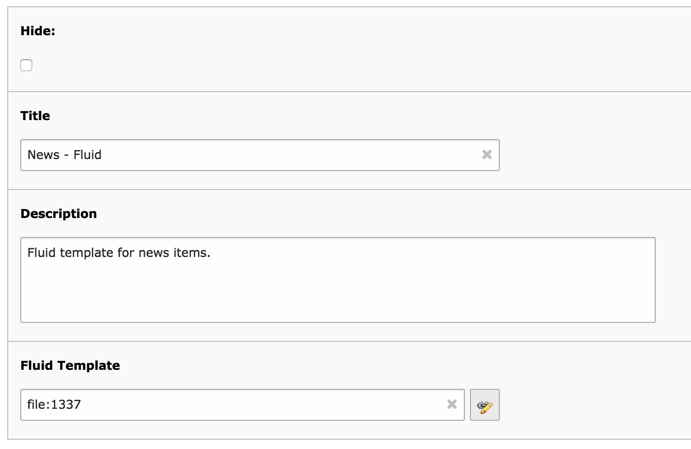
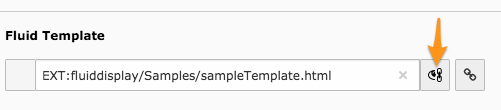
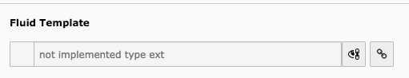

.. ==================================================
.. FOR YOUR INFORMATION
.. --------------------------------------------------
.. -*- coding: utf-8 -*- with BOM.

.. include:: ../../Includes.txt

.. _user-input-screen:

Input screen
------------

This is the Fluid Display input screen. Apart from the title, the only really important parameter is
the reference to the Fluid template file.

	A Fluid Display element and all its input fields

The **Hide** flag is not currently used, although it could be in the future. In the meantime it
can still be used to indicate an unused filter.

The template file can be located either in the "fileadmin" hierarchy or in an extension (using the
:code:`EXT:` syntax). It can be referenced with the syntax :code:`file:xxx` where "xxx" is the uid of
the corresponding sys_file entry. The browser wizard will use that syntax automatically.

Since TYPO3 CMS 8, input fields using the link wizards have changed slighlty. It is still
possible to use the :code:`EXT:` syntax, but you need to click on the icon at the right of the
field to get the standard input field. The so-called link preview whill show up wrong.

	Switching to the standard input field in TYPO3 CMS 8

	Broken preview using the "EXT:" syntax in TYPO3 CMS 8

.. important::

   Using the :code:`EXT:` syntax is not recommended anymore. It will likely be dropped entirely
   in a future version, to make things more consistent with the TYPO3 CMS Core.

   If you store your templates inside an extension, you should create a File Storage pointing
   to that extension, so that you can pick files from there using the file browser.
