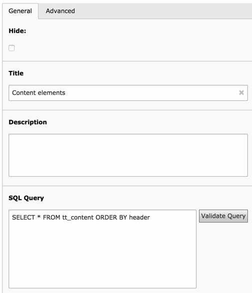

.. ==================================================
.. FOR YOUR INFORMATION
.. --------------------------------------------------
.. -*- coding: utf-8 -*- with BOM.

.. include:: ../../Includes.txt

.. _user-sample-template:

The sample Fluid template
-------------------------

A sample template file is provided in the "Samples" folder of extension "fluiddisplay". It should
give you a pretty good idea of what can be achieved and how to manipulate the Data Structure with
Fluid. The sample template assumes that the following Data Query has been executed:

	The SQL query which is needed to use with the sample template

The elements can simply be related with a standard Display Controller:

	Relating a Fluid Display element to a Data Query element
